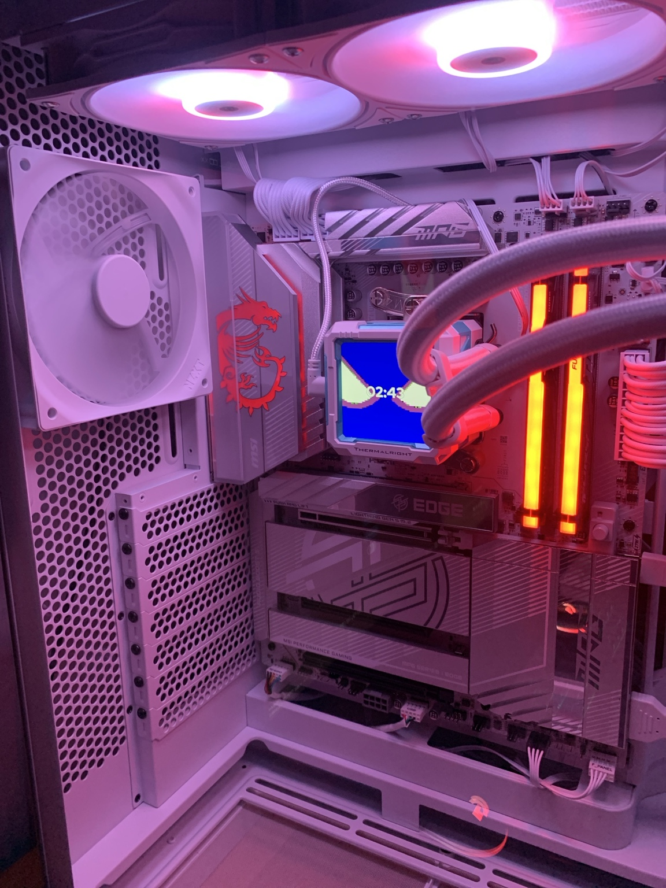
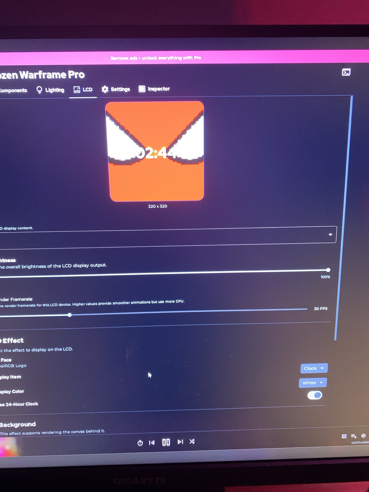
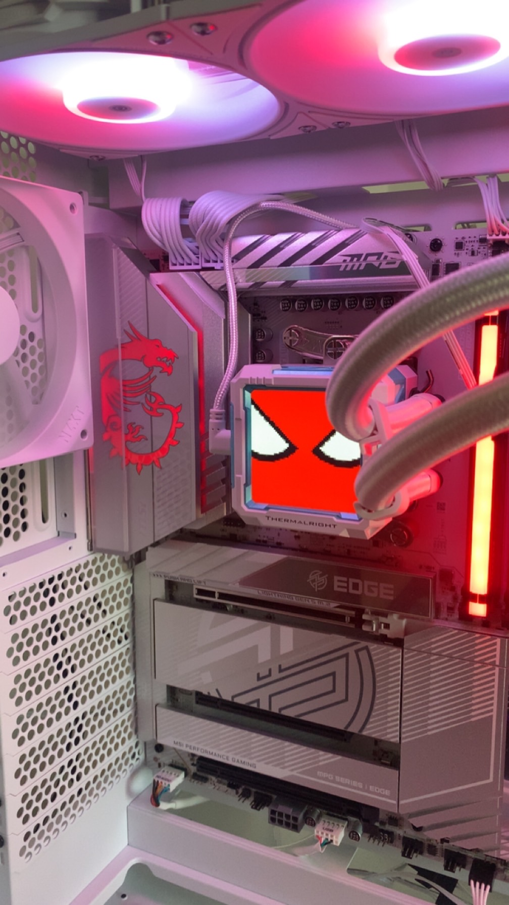

# SignalRGB fix for the Thermalright Frozen Warframe Pro LCD

An unofficial SignalRGB device-plugin override that fixes incorrect colors on the **Thermalright Frozen Warframe Pro 320 x 320 LCD**.

## The problem

SignalRGB rendered the selected image correctly in its LCD preview, but the physical cooler display showed the wrong colors. Red and orange areas could appear blue; trying a simple red/blue channel swap made the background green instead.

### Before: incorrect colors on the LCD



### Before: SignalRGB preview showed the intended image



The preview was correct because the image itself was not damaged. The error happened when SignalRGB's rendered pixel data was sent to the LCD.

### After: correct colors on the physical LCD



## What was going on

This panel uses raw **RGB565** pixels. Each pixel is a 16-bit value stored as two bytes:

```text
SignalRGB output: [GGGBBBBB, RRRRRGGG]
LCD expects:      [RRRRRGGG, GGGBBBBB]
```

The RGB components were already correct, but the two bytes of every pixel arrived in the wrong order. That is why swapping the red and blue channels was not the right fix and produced a green background.

Thermalright's official TRCC 2.1.6 software was inspected to confirm that the Frozen Warframe Pro sends RGB565 data with the most-significant byte first. This plugin applies that byte-order correction only to model ID `0x20`, the Frozen Warframe Pro, so other Thermalright LCD models keep their existing behavior.

The relevant correction is:

```javascript
if (this.getDeviceModel() === 0x20 && this.getDeviceEncoding() === "RGB565") {
	const swapped = new Array(LCDData.length);
	for (let i = 0; i < LCDData.length; i += 2) {
		swapped[i] = LCDData[i + 1];
		swapped[i + 1] = LCDData[i];
	}
	LCDData = swapped;
}
```

## What you need

- A Thermalright Frozen Warframe Pro with the 320 x 320 LCD
- Windows 11 or another Windows version supported by SignalRGB
- SignalRGB installed
- The file [`Thermalright_LCD_Controller_Frozen_Warframe_Pro.js`](Thermalright_LCD_Controller_Frozen_Warframe_Pro.js) from this repository

Tested with:

- USB ID: `87AD:70DB`
- SignalRGB: 2.5.74
- Thermalright TRCC: 2.1.6

## Installation

1. Download [`Thermalright_LCD_Controller_Frozen_Warframe_Pro.js`](Thermalright_LCD_Controller_Frozen_Warframe_Pro.js).
2. Exit Thermalright TRCC completely, including its system-tray process. TRCC and SignalRGB cannot control the LCD at the same time.
3. Exit SignalRGB from its system-tray icon.
4. Open this folder in File Explorer:

   ```text
   %USERPROFILE%\Documents\WhirlwindFX\Plugins\
   ```

5. Copy `Thermalright_LCD_Controller_Frozen_Warframe_Pro.js` into that folder. Create the `Plugins` folder if it does not already exist.
6. Start SignalRGB.
7. Open **Devices > Frozen Warframe Pro > LCD** and select the image, animation, or effect you want.

SignalRGB should report that the custom plugin overrides USB device `87AD:70DB`. The preview and the physical LCD should now use matching colors.

## Troubleshooting

### The LCD is not detected

- Confirm the device appears in Windows and its USB cable is connected.
- Fully close TRCC before opening SignalRGB.
- Confirm the plugin filename ends in `.js`, not `.js.txt`.
- Confirm the plugin is in `%USERPROFILE%\Documents\WhirlwindFX\Plugins\`.
- Restart SignalRGB after copying or changing the plugin.

### The colors are still wrong

- Make sure SignalRGB loaded this custom plugin rather than only its bundled Thermalright plugin.
- Verify that your cooler is the **Frozen Warframe Pro 320 x 320**, not a different Thermalright LCD model.
- Close any other application that may be controlling the cooler display.
- Compare SignalRGB's preview with the physical LCD. If the preview itself is wrong, the source image or selected effect is a separate issue.

## Updating or removing the fix

SignalRGB may eventually include an equivalent fix. After updating SignalRGB, move this custom file out of the `Plugins` folder, restart SignalRGB, and test its bundled plugin.

To remove this override, delete or move `Thermalright_LCD_Controller_Frozen_Warframe_Pro.js` from `%USERPROFILE%\Documents\WhirlwindFX\Plugins\`, then restart SignalRGB.

## Scope and status

This fix was tested on one physical Frozen Warframe Pro unit. Reports from other revisions are welcome; include the cooler model, USB ID, SignalRGB version, and photos of both the SignalRGB preview and physical LCD.

## Attribution and licensing

This is an unofficial community fix and is not affiliated with or endorsed by Thermalright, WhirlwindFX, or SignalRGB.

The controller file is derived from SignalRGB's bundled `Thermalright_LCD_Controller.js`. SignalRGB and the original plugin remain the property of their respective owners. The upstream plugin repository does not currently provide an explicit license file, so this repository does not apply a new license to that derived file.
